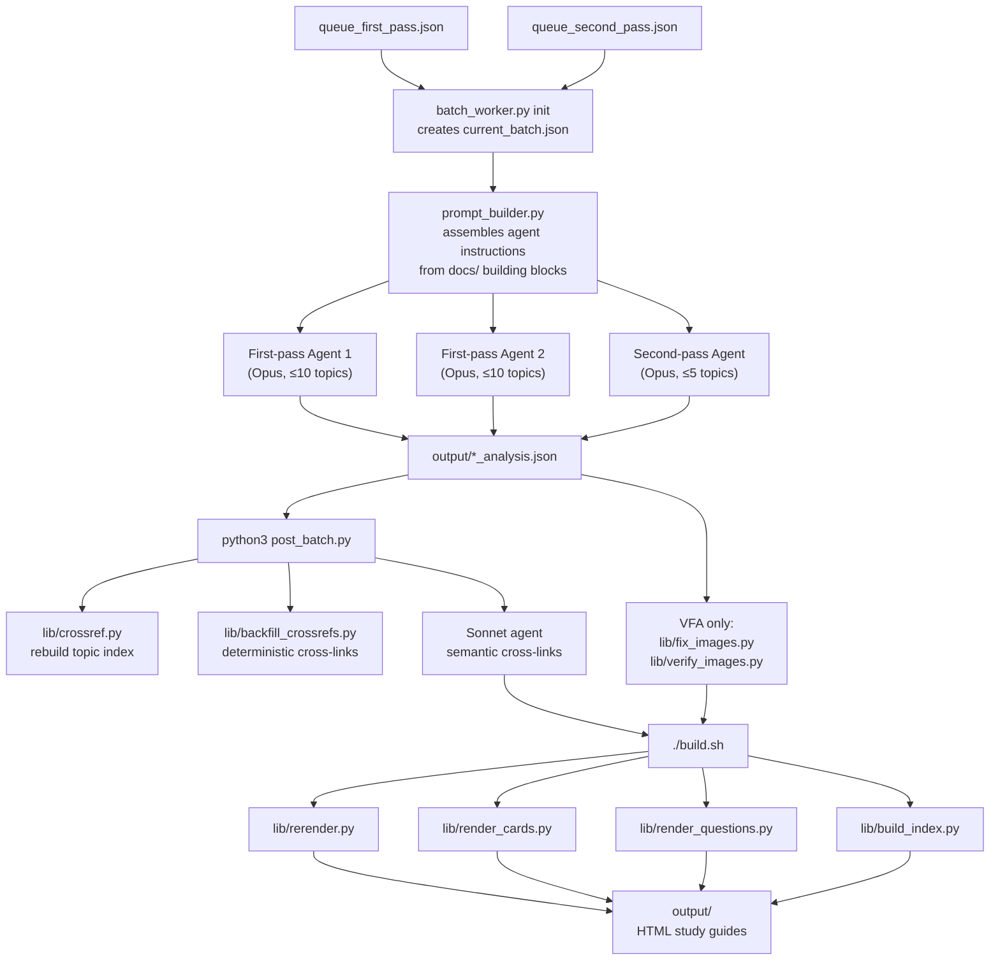

# Stock Knowledge Tool

A quizbowl study tool that pulls clues from the [qbreader](https://www.qbreader.org/) database and generates structured, frequency-ranked HTML study guides. Each guide groups clues by work/subtopic, ranks them by how often they appear, and tags power vs. giveaway clues. Claude is the LLM doing the analysis.

## How It Works

1. **Fetch** — queries qbreader API for all tossups/bonuses where a topic appears as the answerline
2. **Parse** — extracts individual clue sentences with metadata (power mark, giveaway, source set/year)
3. **Analyze** — Claude reads the clues, groups by work/subtopic, ranks by frequency, generates flashcards
4. **Render** — produces self-contained HTML with collapsible sections, embedded images (VFA), cross-links between guides, and Anki export

## File Structure

```
stock/
├── build.sh              # Run all renderers (use this after any batch)
├── serve.sh              # Local dev server (http://localhost:8000)
├── post_batch.py         # Post-batch automation (crossrefs + render prompt)
├── index.html            # Main study guide index (auto-generated)
│
├── lib/                  # All scripts and pipeline internals
│   ├── run.py            # Fetch + parse runner (used by agents and manually)
│   ├── fetch.py          # qbreader API client
│   ├── parse.py          # Clue extraction
│   ├── prompt_builder.py # Assembles agent prompts from docs/ building blocks
│   ├── batch_worker.py   # Queue pop/complete with file locking
│   ├── topic_queue.py    # Global queue management
│   ├── render.py         # Core HTML study guide renderer
│   ├── rerender.py       # Re-render all stock guides from JSON
│   ├── render_cards.py   # Card editor page renderer
│   ├── render_questions.py # Source question page renderer
│   ├── build_index.py    # Index page generator
│   ├── crossref.py       # Rebuild topic_index.json
│   ├── backfill_crossrefs.py # Deterministic cross-link backfill
│   ├── images.py         # Wikimedia Commons image lookup
│   ├── fix_images.py     # Batch image URL fixer (VFA)
│   ├── verify_images.py  # Verify image URLs return 200
│   └── js/
│       ├── search_nav.js # Shared search + navigation for guide pages
│       └── anki_export.js # In-browser Anki .apkg export
│
├── docs/                 # Agent instructions and reference
│   ├── batch_run.md      # How to run batches (read before starting)
│   ├── crossref_backfill.md # Cross-link protocol for Sonnet agent
│   ├── categories.md     # qbreader category/subcategory taxonomy
│   ├── analysis_core.md        # Universal analysis rules (all agents)
│   ├── analysis_first_pass.md  # First-pass additions
│   ├── analysis_second_pass.md # Second-pass (enrichment) additions
│   ├── analysis_cards.md       # Card generation rules
│   ├── analysis_literature.md  # Literature-specific supplement
│   ├── analysis_vfa.md         # Visual Fine Arts supplement
│   ├── analysis_philosophy.md  # Philosophy supplement
│   └── analysis_science.md     # Science supplement
│
├── queue/                # Batch queue state
│   ├── queue_first_pass.json
│   ├── queue_second_pass.json
│   └── current_batch.json
│
├── cache/                # Cached qbreader API responses (gitignored)
├── output/               # Generated HTML + analysis JSON (gitignored)
│   ├── *_stock.html      # Study guides
│   ├── *_cards.html      # Card editor pages
│   ├── *_questions.html  # Source question pages
│   ├── *_analysis.json   # Analysis data (source of truth for re-rendering)
│   ├── topic_index.json  # Cross-reference index
│   └── guides_data.js    # Shared nav/search data
└── memory/               # Claude Code persistent memory (gitignored)
```

## Batch Processing

The main workflow is running batches of agents to generate guides in parallel. Each agent pops topics from a shared queue, fetches and analyzes them, and writes JSON + HTML to `output/`.



### Agent prompt assembly

Prompts are built from modular building blocks in `docs/`, concatenated in order:

```
First-pass:  analysis_core → analysis_first_pass → [category supplement] → analysis_cards
Second-pass: analysis_core → analysis_second_pass → [category supplement] → analysis_cards
```

```bash
python3 lib/prompt_builder.py first --category Literature
python3 lib/prompt_builder.py second --category "Fine Arts"
python3 lib/prompt_builder.py first --category Literature --max-topics 5
```

### Running a batch

```bash
# 1. Check queues
python3 lib/topic_queue.py summary

# 2. Initialize batch (pulls from global queues into current_batch.json)
python3 lib/batch_worker.py init "my-batch" --first 40 --second 10 --category Literature

# 3. Generate prompt and launch agents
python3 lib/prompt_builder.py first --category Literature
# Copy output as agent prompt, launch agents

# 4. Monitor at http://localhost:8000/progress.html

# 5. When all agents finish:
python3 post_batch.py    # rebuilds index + runs deterministic backfill + prints Sonnet prompt
# Launch Sonnet agent with printed prompt
./build.sh               # render everything
```

See `docs/batch_run.md` for full details, sizing rules, and pitfall history.

## Single Topic (Manual)

To generate one guide without the batch system:

```bash
# Fetch and parse clues
python3 lib/run.py "Smetana" "7,8,9,10"

# Then ask Claude Code to analyze:
# "Read output/smetana_clues.txt and analyze following docs/analysis_core.md.
#  Generate the HTML guide using lib/render.py and save analysis JSON."

# Rebuild
./build.sh
```

**Useful flags:**
- 4th arg filters by category: `python3 lib/run.py "Indiana" "7,8,9,10" 2012 "Literature"`
- `--mentions` flag fetches text mentions instead of answerline hits

## Browsing Guides

```bash
./serve.sh
# Open http://localhost:8000
```

Or just open `index.html` directly in a browser.
